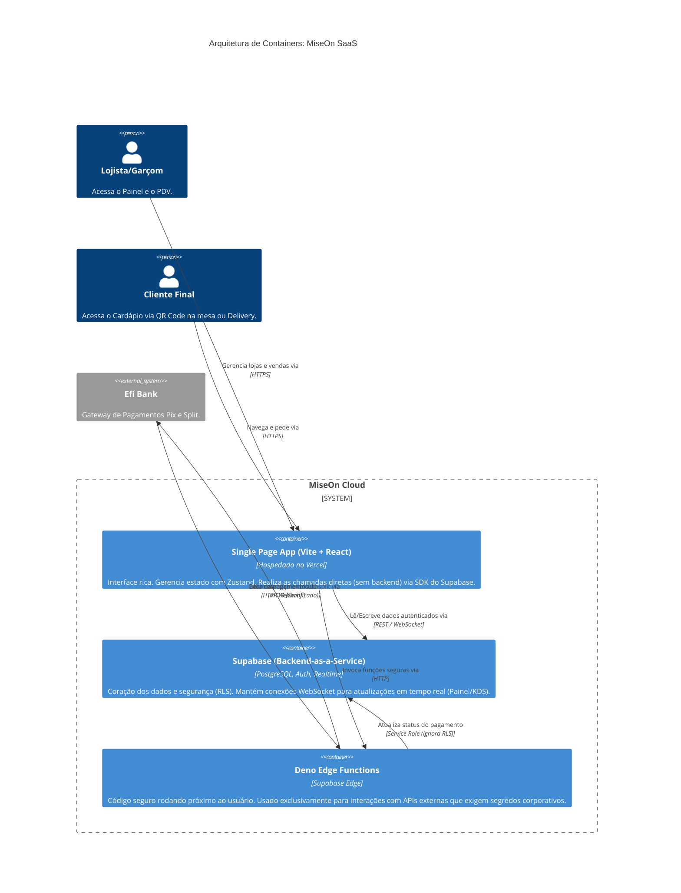
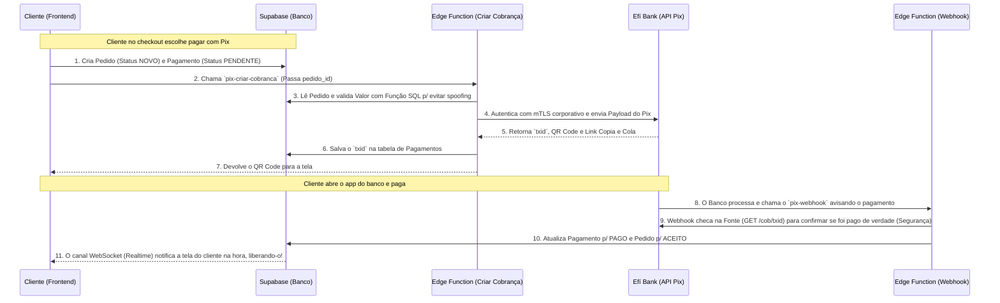

# Arquitetura do Sistema: MiseOn SaaS 🏗️

Bem-vindo(a) à documentação arquitetural do MiseOn. O objetivo deste documento é permitir que novos desenvolvedores entendam a estrutura do sistema, o fluxo de dados e os princípios de segurança em poucos minutos.

---

## 1. Diagrama de Containers (Modelo C4 Simplificado)

O MiseOn é uma plataforma Cloud-Native *serverless*. Toda a complexidade de infraestrutura é abstraída por serviços gerenciados de alto desempenho, reduzindo custos e maximizando a escala.

---

## 2. Padrão de Multi-Tenancy e Segurança de Dados

O MiseOn é um sistema **B2B SaaS**, o que significa que atende centenas de clientes (Lojas) em um mesmo banco de dados compartilhado. A blindagem entre dados de lojas concorrentes é crítica.

**Como funciona o isolamento?**
- Todas as tabelas sensíveis no PostgreSQL (`produtos`, `pedidos`, `categorias`, `mesas`, `pagamentos`, etc.) possuem a coluna `loja_id`.
- A segurança **NÃO** depende do Frontend ou de lógicas de "filtragem" no código (`WHERE loja_id = X`).
- Utilizamos o poder do **Row Level Security (RLS)** do PostgreSQL. 

**Fluxo RLS na Prática:**
1. O usuário (dono da loja) faz login via *Supabase Auth*. Um token JWT é gerado.
2. Este usuário está cadastrado na tabela de permissões (`perfis_lojas`) com acesso ao seu respectivo `loja_id`.
3. As políticas SQL cadastradas no Supabase (RLS Policies) interceptam a query. Se o dono da *Loja A* tentar consultar a tabela de pedidos, o Postgres examinará o JWT dele e **automaticamente cortará** da resposta todos os pedidos da *Loja B*, mesmo que a query SQL do front-end fosse `SELECT * FROM pedidos`. 

---

## 3. Fluxo de Pagamento Pix (End-to-End)

Pagamentos financeiros exigem segurança, certificados TLS e confirmações assíncronas. Como não temos um backend Node.js tradicional, o fluxo intercala o Client e o Edge Computing.

---

## 4. Ledger Financeiro e Garantia Transacional (Fase 3)

Para lidar com finanças e comissões (iFood, etc.), o MiseOn implementa um sistema de **contabilidade de dupla entrada** diretamente no banco de dados.

**Arquitetura do Ledger:**
- Não calculamos o saldo de caixa ou o DRE somando o valor dos `pedidos`. 
- Ao invés disso, utilizamos a tabela `lancamentos_financeiros`. Cada entrada possui uma `conta_debitada`, uma `conta_creditada` e um `valor`.
- **Triggers Atômicas:** Quando um pedido atinge o status `FINALIZADO`, a trigger `fn_trg_status_pedido` executa `fn_lancar_receita_pedido`. Se o pedido é do iFood, a trigger automaticamente divide a receita líquida e a taxa retida em lançamentos separados.
- **Idempotência:** A coluna `receita_lancada` na tabela de pedidos garante que bugs na aplicação jamais resultem em receita duplicada no caixa.
- **DRE:** A *Demonstração de Resultado do Exercício* é materializada via a view `vw_dre_mensal`, calculando Lucro Bruto cruzando Receita, CMV e Estornos diretamente das naturezas contábeis.

---

## 5. Observabilidade em Tempo Real e Resiliência (Fase 3)

O sistema conta com um módulo de observabilidade ativa embarcado no cliente (`useLedgerAlerts`). 

O administrador da loja recebe alertas instantâneos via Toast caso o banco de dados reporte anomalias graves, ouvindo os canais do `Supabase Realtime`:
1. **Estorno Suspeito:** Um registro de estorno é criado muito tempo após a venda.
2. **Estoque Comprometido:** Um pedido foi Cancelado, mas o estoque já havia sido baixado (alerta para checagem física).
3. **Falhas Críticas de Webhook:** As Edge Functions enviam um broadcast no canal `webhook-erros` caso recebam requisições com assinatura HMAC inválida ou payloads corrompidos.

---

## 6. Tecnologias Críticas e Padrões

Neste projeto adotamos tecnologias modernas e ferramentas otimizadas:

- **Frontend Core**: Vite + React 19 + TypeScript. Optamos por *Strict Mode* total para garantir que não haja vazamentos de tipagem em *runtime*. 
- **Estilização**: TailwindCSS v4 + Componentes Radix UI adaptados (para Acessibilidade e Teclado). A arquitetura visual é modular (arquivos `<component>.tsx`).
- **Gerenciamento de Estado**: Embora usemos React Query (implícito) para cacheadas, usamos `Zustand` para estado global que não depende de servidor (ex: Carrinho de Compras, Modal de Configurações, Permissões de Usuário na sessão atual).
- **Code-Splitting Avançado:** (Fase 3) A aplicação usa configuração customizada de chunks (`manualChunks` no Vite) e `React.lazy()` extensivo. Isso divide a aplicação em pedaços lógicos, carregando sob demanda e isolando libs pesadas (Recharts, Leaflet, Konva), despencando o LCP inicial.
- **Tempo Real e Sincronização**: *Não gerenciamos WebSockets crus (Socket.io)*. Assinamos diretamente os canais do `Supabase Realtime`, permitindo que o Painel do Lojista (PDV e Pedidos) reaja instantaneamente a mudanças no banco (ex: um INSERT na tabela pedidos vira uma notificação visual em ms).
- **QA e Performance:** 
  - Testes unitários/integração via **Vitest**, que se conectam ao Supabase via `service-role` testando garantias de Dupla Entrada, Estornos e concorrências de pedidos diretamente no banco.
  - Testes de Estresse via **K6**, simulando +200 requisições simultâneas de Webhook Pix e validando os SLAs operacionais e a ausência de *Race Conditions*.
- **DevOps e Qualidade**: O repositório roda com proteção **Husky** + **Lint-Staged** no pre-commit. Nenhum código quebra regras do *ESLint (Flat Config)* ou violações do *TypeScript* chega à `main`.
